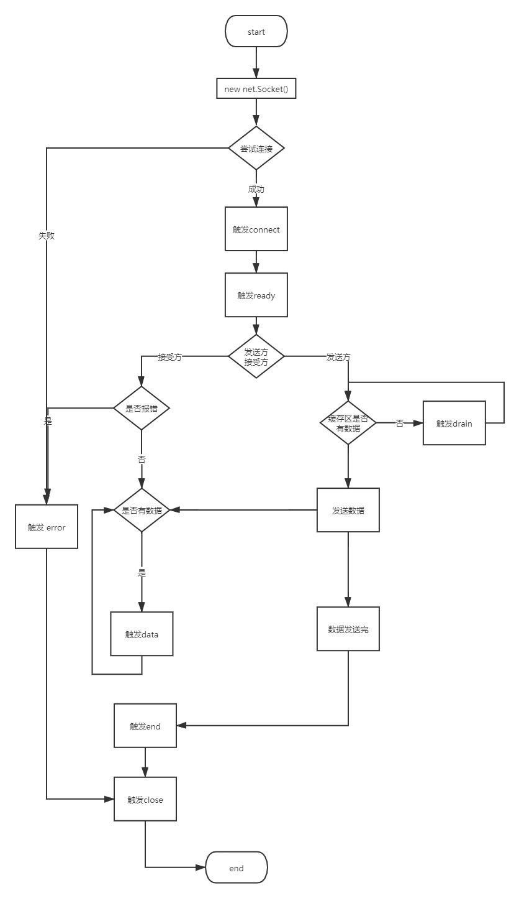

# node net模块

node中网络通信支持 `UDP` 和 `TCP` 两大传输协议; 

我们今天来讲 `TCP` .(TCP 协议在node的net 模块中)

## TCP

大致了解一下 `TCP` (网络传输协议)

* 支持面向连接的传输服务
* 支持字节流的传输
* 支持全双工
* 支持多个同时并发的TCP连接
* 支持可靠的传输服务

### 支持面向连接的传输服务

端到端的传输: 程序双方都通过端口号来标识
应用程序在使用TCP传输数据之前, 需要进行 `3次握手` , 确保程序之间通信的可靠性; 

TCP之所以这么做, 是因为 IP 协议是无连接不可靠的; 在IP 协议之上来保证通信的
可靠性, 就只能让TCP协议自己来做; 

### 支持字节流的传输

> 流(stream) : 相当于一个管道, 从一端放入什么内容, 从另一端可以原样的取出来; 它描述了一个不出现丢失, 重复和乱序的数据传输过程.

应用程序和TCP协议每次交互的 `数据长度可能都不相同` . 但是TCP协议是将应用程序提交的数据看作
一连串的, 无结构的 `字节流` . 因此, 接受端的应用程序数据字节的起始与终结位置必须由程序自己确定.

为了能支持字节流传输, 发送端和接受端都需要使用 `缓存 cache` ; (这个会在后面 data事件中验证)

为啥不直接发送呢?
肯定不行啊! 你想你在客户端输入一个字符就发送一个请求, 那岂不是太浪费了!

> TCP 报文长度在 20 ~ 60 B 固定长度 20B, 选项和填充 40B

### 支持全双工

> 全双工: 接受端和发送端可以互相通信

`TCP` 协议允许通信双方的应用程序在任何时候都可以进行发送数据.
由于双方都设有发送和接受的 `缓冲区` ; 

发送方把数据发送到TCP的发送端缓存区, 但不会立刻发送; 发送的时机由TCP来控制; 
而接受端接受到数据之后, 会把数据放到缓冲区中; 由高层应用程序读取.

### 支持多个同时并发的TCP连接

`TCP` 协议支持同时建立多个连接. 这一点是毋庸置疑的; 
尤其是在 接受端 (server) 

### 支持可靠的传输服务

TCP是一种可靠的传输服务协议. 它使用确认机制来检查数据是否安全完整地到达, 并且提供拥塞控制功能; 
主要是靠对发送和接受的数据进行数据跟踪, 确认和重传; 

## Socket

> 套接字（socket）是一个抽象层，应用程序可以通过它发送或接收数据，可对其进行像对文件一样的打开、读写和关闭等操作。套接字允许应用程序将I/O插入到网络中，并与网络中的其他应用程序进行通信。网络套接字是IP地址与端口的组合。

上面摘自百度百科; 
简书上有讲 socket很好的文章

[https://www.jianshu.com/p/066d99da7cbd](https://www.jianshu.com/p/066d99da7cbd)

当然, 在nodejs中的Socket肯定进行一些封装; 

下面有个node socket关于事件的大致流程图; 
其中缺少了timeout和lookup事件; (一图顶千言)



我们可以通过vs code提供的ts文件, 看到Socket中的属性

分配两个缓冲区，输入缓冲区和输出缓冲区。

``` ts
// 写入而缓冲的字符数
readonly bufferSize: number;
// 接收的字节数量
readonly bytesRead: number;
// 发送的字节数量
readonly bytesWritten: number;
// 它将保持为真，直到 socket 连接，然后设置为 false 并触发 'connect' 事件
readonly connecting: boolean;
readonly destroyed: boolean;
readonly localAddress: string;
readonly localPort: number;
// 三元组
readonly remoteAddress?: string;
// 远程 IP 协议。'IPv4' 或 'IPv6'
readonly remoteFamily?: string;
readonly remotePort?: number;
```


Socket 继承 `Stream` 流
Stream 是啥，这展开来讲就复杂了，涉及到IO方面的知识。
以后会补充上去。

可以看链接的文章了解一些。

[https://www.runoob.com/nodejs/nodejs-stream.html](https://www.runoob.com/nodejs/nodejs-stream.html)


## Server

Socket 在客户端和服务端有不同的功能。

服务端会监听 listen 客户端的请求；

从api层面上我们也可以看的出来。

``` js
// net 模块
function createServer(connectionListener ? : (socket: Socket) => void): Server;

function createServer(options ? : {
    allowHalfOpen ? : boolean,
    pauseOnConnect ? : boolean
}, connectionListener ? : (socket: Socket) => void): Server;

function createConnection(options: NetConnectOpts, connectionListener ? : () => void): Socket;

function createConnection(port: number, host ? : string, connectionListener ? : () => void): Socket;

function createConnection(path: string, connectionListener ? : () => void): Socket;
```

创建一个 `Connection` 就是创建一个 `Socket` 
创建一个 `Server` 其中也是需要传入一个 `Socket` 的。

因为，TCP这一块是通过socket进行传输的。

我们可以再看一下 `Server` 

``` js
 class Server extends events.EventEmitter {
     constructor(connectionListener ? : (socket: Socket) => void);
     constructor(options ? : {
         allowHalfOpen ? : boolean,
         pauseOnConnect ? : boolean
     }, connectionListener ? : (socket: Socket) => void);
     // 省去以一些方法
 }
```

底层对网络的处理都是通过node底层去做的。
要看的话就得跟到很深了。 这里就不展开了。

node会帮我们处理好，当网络请求到了，会触发响应的事件，结束了，也会触发事件。
我们处理好内容就好。

当然了，如果有精力也可以去看一下node源码。

## 一个请求的流程

代码的注释非常详细

```bash
# 要先启动server才行
node server.js

node client
```

### server

```js
const net = require('net');
let count = 1;

/**
 * 创建一个 server 用于监听client的请求
 * 里面传入的是 connection的监听器，处理conneciton 事件
 * 
 */
const server = net.createServer((clientSocket) => {
    console.log(`客户端已连接，接受到ip ：${clientSocket.remoteAddress}  port: ${clientSocket.remotePort} 的socket`)

    // 当有数据传输进来时; data的触发因为有缓存和网络的原因，不一定会触发几次
    clientSocket.on('data', function (buffer) {
        console.log('data事件触发 No : ' + count)
        count++
        console.log('传输的数据 : ' + buffer.toString())
    })

    clientSocket.write('来自server的信息： HELLO CLIENT! ');

    // 可读流 -> 可写流 （socket是Duplex ）
    // 这样会把从客户端拿到的data ，再返回给客户端
    // socket.pipe(socket); 

    clientSocket.on('end', () => {
        console.log('client 调用了end');
    });
});


console.log('-----------调用listen之前------------')
// 此时listeing = false 说明还未监听
// 不要在 'listening' 事件触发之前调用 server.address()
// 调用了也没有用 输出null
console.log('server.listening: ' + server.listening)
console.log('server.address(): ' + server.address())

// 指定端口,监听成功后，会调用回调 和下面的listening相同
server.listen(8124, () => {
    // 
    console.log('server.listen(8123) ');
});

console.log('-----------调用listen之后------------')
console.log('server.listening: ' + server.listening)
console.log('server.address(): ' + JSON.stringify(server.address()))

// 监听成功后，会调用； 和server.listen()的回调属于同一个事件
server.on('listening', () => {
    console.log(`server.on('listening',()=>{} `);
})

// 当出错的时候调用，如果没有处理node就崩了
server.on('error', (err) => {
    throw err;
});

// 当 server 关闭的时候触发。 如果有连接存在，直到所有的连接结束才会触发这个事件。
server.on('close', () => {
    console.log(`server.on('close')`)
})


// 当有一个新连接到来的时候，触发
server.on('connection', socket => {
    console.log(`server.on('connection')`)
})
```


### client

```js
const net = require('net');

/**
 * Socket 是全双工的，也就意味着，数据可以相互传递
 */

// 指定port 要和server listen的一致
// 回调是 connnection的事件
const clientSocket = net.createConnection({ port: 8124 }, () => {
  // 连接到 server端之后
  console.log('------已连接到服务器-----');
  clientSocket.write('来自clien的信息: 你好世界!');

  // 这里循环输出了3次，但是只触发了一次事件
  for (let i = 0; i < 3; i++) {
    clientSocket.write('i = ' + i)
  }

  // 这里调用end 会触发
  clientSocket.end()
});

/**
 * events.EventEmitter
 *   1. close 关闭连接
 *   2. connect 连接
 *   3. data 数据
 *   4. drain 写入缓冲区变为空时触发。可以用来做上传节流
 *   5. end data传输结束时
 *   6. error 出现错误
 *   7. lookup 在找到主机之后创建连接之前触发。不可用于 Unix socket。
 *   8. timeout 超时
 *  我们主要看 connect ，data ，end ，close
 */

clientSocket.on('data', (data) => {
  console.log('data : ' + data.toString());
});

clientSocket.on('end', () => {
  console.log('已从服务器断开');
});
```

## 参考文档

* 计算机网络 清华大学出版社 吴功宜
* nodejs 官网API net
* 百度百科 Socket

